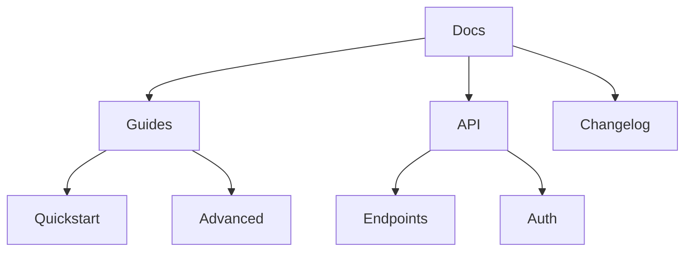

## Overview

Manage your Orange Documentation content efficiently to keep your project docs organized and up-to-date. You create new pages, structure folders logically, optimize search, and collaborate with your team using built-in tools. This guide covers essential workflows for effective content management.

<Columns cols={3}>
  <Card title="Create Pages" icon="file-plus" href="#page-creation">
    Start new docs quickly with the editor or CLI.
  </Card>
  <Card title="Organize Folders" icon="folder" href="#folder-structures">
    Build intuitive hierarchies for better navigation.
  </Card>
  <Card title="Collaborate" icon="users" href="#collaboration">
    Share edits and review changes seamlessly.
  </Card>
</Columns>

## Page Creation and Editing

Create and edit pages directly in the web editor or via CLI for advanced control.

<Steps>
  <Step title="Create a New Page" icon="plus">
    Navigate to your workspace. Click **New Page** in the sidebar. Enter a title like "API Reference" and select a parent folder.
  </Step>
  <Step title="Edit Content" icon="edit-3">
    Open the page. Use the Markdown editor for text, or switch to visual mode. Add components like `<Callout>` for notes.
  </Step>
  <Step title="Preview and Publish" icon="eye">
    Preview changes in real-time. Click **Publish** to make live, or **Save Draft** for later.
  </Step>
</Steps>

<Callout kind="tip">
  Use keyboard shortcuts like <kbd>Ctrl</kbd>+<kbd>S</kbd> to save quickly and <kbd>Ctrl</kbd>+<kbd>K</kbd> for search.
</Callout>

## Folder Structures

Organize content into logical folders to improve navigation. Avoid deep nesting—aim for 2-3 levels max.



<CodeGroup tabs="File Tree,CLI Commands">
```bash
docs/
├── guides/
│   ├── quickstart.mdx
│   └── advanced.mdx
├── api/
│   └── endpoints.mdx
└── changelog.mdx
```

```bash
# Create folder structure
mkdir -p docs/{guides,api}
touch docs/guides/quickstart.mdx
touch docs/api/endpoints.mdx
```
</CodeGroup>

## Search and Navigation

Enable global search by adding keywords to page frontmatter. Use sidebar navigation and breadcrumbs for quick access.

| Feature | Description | Best Practice |
|---------|-------------|---------------|
| Search | Full-text across pages | Add `keywords: ["api", "setup"]` to frontmatter |
| Breadcrumbs | Shows hierarchy | Auto-generated from folders |
| Sidebar | Collapsible menu | Limit top-level folders to 5-7 |

<Tabs>
  <Tab title="Web Search" icon="search">
    Press <kbd>Ctrl</kbd>+<kbd>K</kbd>. Type "authentication" to find relevant pages instantly.
  </Tab>
  <Tab title="Advanced Filters" icon="filter">
    Filter by tags or date. Use `tag:api` for API-specific results.
  </Tab>
</Tabs>

## Collaboration Tools

Invite team members and track changes with version history.

<ExpandableGroup>
  <Expandable title="Invite Collaborators" default-open="true">
    Go to Workspace Settings > Members. Add emails and set roles: Admin, Editor, Viewer.
  </Expandable>
  <Expandable title="Version History">
    Click **History** on any page. Revert changes or compare diffs. @mentions notify teammates in real-time.
  </Expandable>
</ExpandableGroup>

<Callout kind="alert">
  Enable branch previews for pull requests to review changes before merging.
</Callout>

Follow these practices to maintain clean, searchable docs that scale with your project.