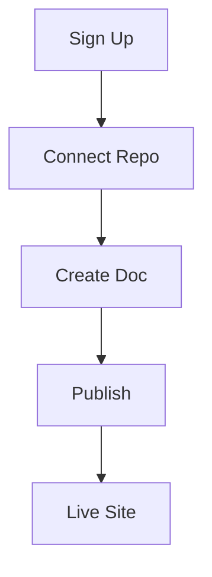

## Overview

Set up Orange Documentation quickly to start building your project's docs site. You create an account, complete initial setup, add your first document, and explore the interface. Follow these steps to publish your first page in under 5 minutes.

<Callout kind="tip">
  You need a GitHub, GitLab, or Bitbucket account for repository integration.
</Callout>

## Create Your Account

Sign up and verify your account to access the dashboard.

<Steps>
  <Step title="Visit the site" icon="globe">
    Navigate to [orange-docs.com](https://orange-docs.com) and click **Sign Up**.
  </Step>
  <Step title="Choose provider" icon="user-plus">
    Select your preferred auth provider: GitHub, Google, or email.
  </Step>
  <Step title="Verify email" icon="mail">
    Check your inbox and click the verification link.
  </Step>
</Steps>

## Initial Setup

Connect your repository and configure your workspace.

<Tabs>
  <Tab title="GitHub" icon="github">
    Authorize Orange Documentation to access your repos. Select your project repository and grant permissions.
    
    <CodeGroup tabs="CLI,Web">
      ```bash
      npx orange-docs init my-project
      # Links your local repo to Orange
      ```
      ```javascript
      // In your package.json scripts
      "docs:build": "orange-docs build"
      ```
    </CodeGroup>
  </Tab>
  <Tab title="GitLab" icon="git-branch">
    Paste your GitLab repo URL and add the webhook secret.
  </Tab>
</Tabs>

<Callout kind="info">
  Enable auto-deploy on push to `main` for continuous updates.
</Callout>

## Create Your First Document

Build and publish a page using the editor.

<Steps>
  <Step title="New page" icon="file-plus">
    Click **New Document** in the dashboard and name it `introduction.mdx`.
  </Step>
  <Step title="Add content" icon="edit-3">
    Use the visual editor or Markdown. Add frontmatter and body content.
  </Step>
  <Step title="Preview & Publish" icon="eye">
    Preview changes, then click **Publish**. Your site updates instantly.
  </Step>
</Steps>

Here's a starter template for your first page:

````mdx
```javascript
// pages/introduction.mdx
---
title: Introduction
description: Welcome to your docs.
---

## Welcome

Start writing here.
```
````

## Basic Interface Tour

Explore key areas of the dashboard.

<Columns cols={3}>
  <Card title="Editor" icon="edit-3" href="/docs/editor">
    Write MDX with live preview and syntax highlighting.
  </Card>
  <Card title="Files" icon="folder" href="/docs/files">
    Manage your docs tree, uploads, and assets.
  </Card>
  <Card title="Settings" icon="settings" href="/docs/settings">
    Customize themes, SEO, and integrations.
  </Card>
</Columns>

<Expandable title="Advanced Workflow" default-open="false">
  Customize your build process with plugins:
  
  ```bash
  npm install @orange-docs/plugin-search
  ```
  
  Add to `orange.config.js`:
  
  ```javascript
  module.exports = {
    plugins: ['search'],
    theme: { primaryColor: '#3B82F6' }
  };
  ```
</Expandable>

## Next Steps

Your site is live! Integrate search, add analytics, or invite collaborators. Check the sidebar for more guides.

