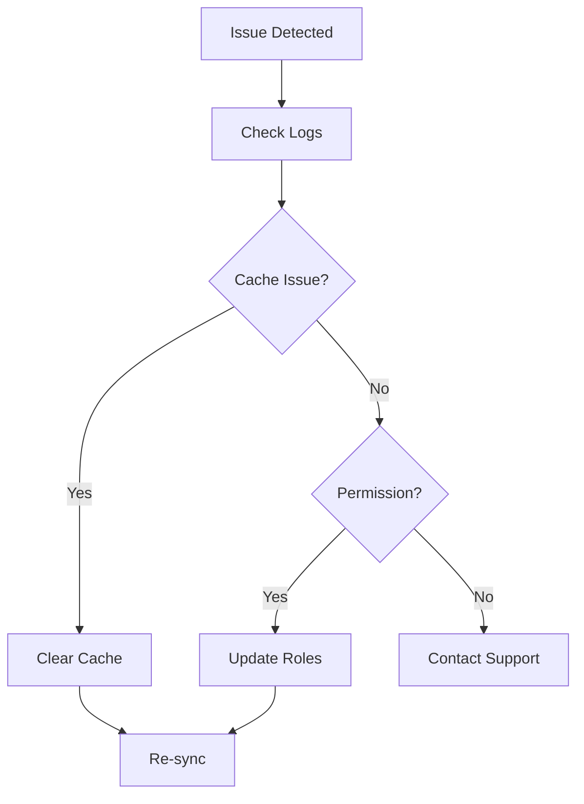

## Sync Errors

Sync errors often occur during Git integration or content updates in Orange Documentation. Follow these steps to diagnose and fix them.

<Steps>
  <Step title="Check Connection" icon="network">
    Verify your repository URL and credentials.

    ```bash
    git remote -v
    ```

    Ensure the remote points to your Orange-linked repo.
  </Step>
  <Step title="Clear Cache" icon="refresh-cw">
    Run the sync cache clear command.

    <CodeGroup tabs="CLI,Dashboard">
      ```bash
      orange sync --clear-cache
      ```
      ```typescript
      // In dashboard settings
      await orangeClient.clearSyncCache();
      ```
    </CodeGroup>
  </Step>
  <Step title="Re-sync" icon="git-pull-request">
    Trigger a manual sync and monitor logs.

    ```bash
    orange sync --verbose
    ```
  </Step>
</Steps>

<Callout kind="alert">
  If errors persist with `401 Unauthorized`, regenerate your API token in account settings.
</Callout>

## Permission Issues

Permission problems arise when users lack access to edit or view docs. Use these platform-specific solutions.

<Tabs>
  <Tab title="Team Admin" icon="users">
    Assign roles via the dashboard.

    1. Navigate to **Team > Members**.
    2. Select user and set role to `Editor` or `Viewer`.

    <Image
      src="https://example.com/permissions-dashboard.png"
      alt="Permissions dashboard screenshot"
      width="800"
      height="500"
    />
  </Tab>
  <Tab title="GitHub Integration" icon="github">
    Update repo permissions.

    ```yaml
    # .github/workflows/docs.yml
    permissions:
      contents: read
      pull-requests: write
    ```
  </Tab>
</Tabs>

## Performance Tips

Optimize your documentation site for faster loads and better user experience.

- **Minimize images**: Compress assets to `<500KB` each.
- **Lazy load sections**: Use `loading="lazy"` on images.
- **Purge unused CSS**: Run builds with `--purge` flag.

| Tip | Impact | Command |
|-----|--------|---------|
| Enable caching | `>50%` faster loads | `orange build --cache` |
| Split large docs | Reduces bundle size | Use `<Expandable>` components |
| Update dependencies | Fixes vulnerabilities | `npm update` |

<Callout kind="tip">
  Monitor performance with Lighthouse audits targeting a score `>90`.
</Callout>

## Advanced Debugging

<Expandable title="View Detailed Logs" default-open="false">

Access verbose logs for deeper insights.

```bash
orange logs --level=debug --since=1h
```

Common errors:

```json
{
  "error": "ENOSPC: no space left on device",
  "path": "/tmp/orange-cache"
}
```

Free disk space and retry.
</Expandable>



## Support Resources

<Columns cols={3}>
  <Card title="Documentation" icon="book-open" href="/docs/support">
    Full guides and FAQs.
  </Card>
  <Card title="Community Forum" icon="message-circle" href="https://forum.orange-docs.com" target="_blank">
    Ask questions and share solutions.
  </Card>
  <Card title="Contact Support" icon="mail" href="mailto:support@orange-docs.com" cta="Email Us">
    Priority help for paid plans.
  </Card>
</Columns>